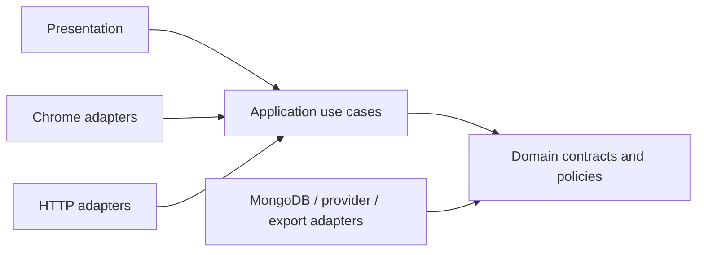
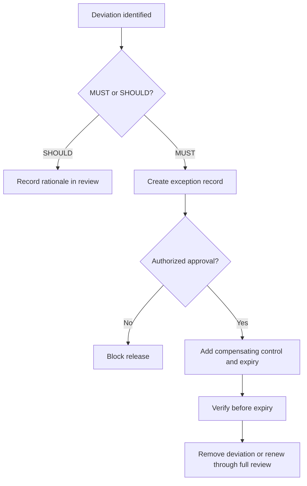

# ClassMate AI — Project Rules

**Version:** 1.0.0  
**Purpose:** Establish binding product, engineering, security, privacy, AI, UX, and delivery rules for every contributor and release.

## Table of Contents

1. [Rule System](#1-rule-system)
2. [Product Rules](#2-product-rules)
3. [Architecture Rules](#3-architecture-rules)
4. [Chrome Extension Rules](#4-chrome-extension-rules)
5. [Privacy and Security Rules](#5-privacy-and-security-rules)
6. [AI Rules](#6-ai-rules)
7. [Data Rules](#7-data-rules)
8. [UX and Accessibility Rules](#8-ux-and-accessibility-rules)
9. [Quality and Delivery Rules](#9-quality-and-delivery-rules)
10. [Governance and Exceptions](#10-governance-and-exceptions)
11. [Examples](#11-examples)
12. [Best Practices](#12-best-practices)
13. [Design Decisions](#13-design-decisions)
14. [Engineering Notes](#14-engineering-notes)
15. [Future Improvements](#15-future-improvements)

## 1. Rule System

The keywords **MUST**, **MUST NOT**, **SHOULD**, **SHOULD NOT**, and **MAY** carry normative meaning. A MUST violation blocks release unless an approved, time-bounded exception exists. A SHOULD deviation requires rationale in the pull request or architecture record. Rules apply to extension, backend, build tooling, prompts, data operations, and documentation.

Rule identifiers are stable. Enforcement is one of: automated (`A`), review (`R`), operational control (`O`), or combined.

## 2. Product Rules

| ID | Rule | Enforcement |
|---|---|---|
| PRD-001 | The core study flow MUST work without a paid API or mandatory subscription. | A/R |
| PRD-002 | No core flow MUST require leaving the active study page. | R |
| PRD-003 | Features MUST map to a defined student job and measurable outcome. | R |
| PRD-004 | Generated academic formats MUST be labeled as study aids, not guaranteed grading outcomes. | A/R |
| PRD-005 | The product MUST NOT submit assignments, bypass access controls, or facilitate cheating. | R/O |
| PRD-006 | Destructive operations MUST disclose scope and offer undo or explicit confirmation. | A/R |
| PRD-007 | New-user defaults MUST optimize clarity and privacy, not engagement or monetization. | R |
| PRD-008 | Paid models MUST be opt-in and MUST NOT be selected by fallback without prior consent. | A |

## 3. Architecture Rules

| ID | Rule | Enforcement |
|---|---|---|
| ARC-001 | Domain logic MUST NOT import Chrome, React, database, or provider SDK modules. | A |
| ARC-002 | Provider SDKs MUST be isolated behind the AI provider contract. | A/R |
| ARC-003 | Content scripts MUST be treated as untrusted boundary adapters. | R |
| ARC-004 | Messages crossing extension contexts MUST be schema-validated and versioned. | A |
| ARC-005 | Service-worker workflows MUST persist recoverable state before asynchronous external work. | A/R |
| ARC-006 | Shared packages MUST expose public entry points; deep imports are prohibited. | A |
| ARC-007 | Circular dependencies are prohibited. | A |
| ARC-008 | Database access MUST occur through repositories or application services, never UI handlers. | A/R |
| ARC-009 | API routes MUST be thin adapters for authentication, validation, orchestration, and response mapping. | R |
| ARC-010 | Stored schemas, messages, APIs, prompt templates, and export formats MUST be explicitly versioned. | A/R |
| ARC-011 | Runtime configuration MUST be validated at startup/build time and MUST fail closed for security settings. | A |
| ARC-012 | No module SHOULD exceed 300 logical lines without a documented cohesion rationale. | A/R |

Dependency direction is inward:

## 4. Chrome Extension Rules

| ID | Rule |
|---|---|
| EXT-001 | Manifest V3 is mandatory; remote executable code is prohibited. |
| EXT-002 | Permissions MUST be least-privilege, justified, and requested at the point of value. |
| EXT-003 | Broad host permissions MUST NOT be required when `activeTab` or optional origins suffice. |
| EXT-004 | Content scripts MUST NOT read password, payment, hidden, or editable form values. |
| EXT-005 | Page-derived HTML MUST be sanitized and rendered as data, never executed. |
| EXT-006 | Every sender, origin, tab, frame, and message type MUST be verified before privileged action. |
| EXT-007 | Durable state MUST NOT rely on service-worker memory, timers, or open ports. |
| EXT-008 | Side Panel drafts MUST survive focus changes, tab changes, and worker suspension. |
| EXT-009 | `chrome.storage.sync` MUST NOT contain API keys, source bodies, or sensitive student content. |
| EXT-010 | Incognito behavior MUST be isolated, documented, and disabled by product default. |

## 5. Privacy and Security Rules

### 5.1 Privacy

| ID | Rule |
|---|---|
| PRV-001 | Capture MUST be user-initiated and limited to the selected source scope. |
| PRV-002 | Context preview and destination provider MUST be inspectable before transmission. |
| PRV-003 | Captured content MUST be ephemeral unless the student explicitly saves it or enables history. |
| PRV-004 | Telemetry MUST exclude URLs with query strings, prompts, page content, generated text, credentials, and user notes. |
| PRV-005 | Collection MUST have a stated purpose, retention period, lawful basis where applicable, and deletion path. |
| PRV-006 | Account deletion MUST cascade or anonymize server data according to the documented retention policy. |
| PRV-007 | Export and deletion MUST be self-service and verifiable. |
| PRV-008 | Privacy-sensitive defaults MUST remain local-first and telemetry-off where consent is required. |

### 5.2 Security

| ID | Rule |
|---|---|
| SEC-001 | Secrets MUST NOT appear in source, logs, analytics, URLs, crash reports, or synced browser storage. |
| SEC-002 | All external traffic MUST use TLS except explicit loopback Ollama endpoints. |
| SEC-003 | JWTs MUST be short-lived, audience/issuer validated, and refreshed with rotation and reuse detection. |
| SEC-004 | Authentication errors MUST NOT reveal account existence. |
| SEC-005 | User-controlled Markdown, links, diagrams, and model output MUST be sanitized with an allowlist. |
| SEC-006 | Page content is untrusted and MUST NOT override system/developer policy or invoke tools. |
| SEC-007 | State-changing API operations MUST enforce authentication, authorization, validation, rate limits, and idempotency where retryable. |
| SEC-008 | Dependencies, builds, and release artifacts MUST be scanned and reproducible enough for provenance review. |
| SEC-009 | Logs MUST use structured safe fields and documented redaction. |
| SEC-010 | Security incidents MUST have containment, key rotation, notification, and recovery procedures. |

## 6. AI Rules

| ID | Rule |
|---|---|
| AIR-001 | All models MUST be accessed through capability-based provider interfaces. |
| AIR-002 | Routing MUST honor explicit user choice, free-first policy, privacy mode, task capability, and context limit. |
| AIR-003 | Fallback MUST be bounded, observable, and free-to-free unless the user opted into paid use. |
| AIR-004 | Prompts MUST delimit source text and state that embedded instructions are untrusted. |
| AIR-005 | Citation identifiers MUST originate from supplied chunks; the model MUST NOT invent URLs or offsets. |
| AIR-006 | Outputs requiring structure MUST be schema-validated and repaired at most once before safe fallback. |
| AIR-007 | Internal chain-of-thought MUST NOT be requested, stored, or shown. |
| AIR-008 | Streaming MUST support cancellation and persist final status: completed, cancelled, failed, or incomplete. |
| AIR-009 | Provider errors MUST map to normalized categories without exposing raw secrets or request bodies. |
| AIR-010 | Evaluation gates MUST cover grounding, correctness, pedagogy, safety, format adherence, latency, and cost. |
| AIR-011 | Prompt changes MUST be versioned, evaluated, and independently deployable or reversible. |
| AIR-012 | Model-generated content MUST be visibly identifiable and editable. |

## 7. Data Rules

- Every collection MUST have an owner, schema version, indexes, retention policy, and deletion behavior.
- All identifiers exposed publicly MUST be non-sequential and unguessable.
- Server timestamps are authoritative for synchronized records; client timestamps are retained only as metadata.
- Optimistic concurrency MUST prevent silent overwrites of notes and collections.
- Soft deletion is used only when recovery, synchronization, or audit requires it; a purge job MUST enforce expiry.
- Encryption in transit is mandatory. Sensitive server data MUST use managed encryption at rest; field-level encryption is considered for provider credentials.
- Migrations MUST be backward-compatible during rolling deployment, resumable, observable, and safe to re-run.
- Analytics events MUST use an approved schema and MUST NOT become a shadow content database.
- Backups MUST have defined recovery point and recovery time objectives and quarterly restoration evidence.

## 8. UX and Accessibility Rules

| ID | Rule |
|---|---|
| UX-001 | One dominant action per view; secondary actions MUST not compete visually. |
| UX-002 | Context, provider state, generation status, and save state MUST be visible. |
| UX-003 | Loading MUST communicate progress without fabricated percentages. |
| UX-004 | Errors MUST state what happened, what was preserved, and the next viable action. |
| UX-005 | Keyboard access MUST cover capture, navigation, generation, cancellation, saving, and dialogs. |
| UX-006 | Focus MUST be managed deterministically after navigation, menus, dialogs, and errors. |
| UX-007 | Color contrast, reflow, text spacing, target size, and reduced motion MUST meet WCAG 2.2 AA targets. |
| UX-008 | Motion MUST explain hierarchy or state and MUST not delay task completion. |
| UX-009 | Icon-only controls MUST have accessible labels and tooltips where discovery benefits. |
| UX-010 | User language MUST be respectful, concise, and free of manipulative urgency. |

## 9. Quality and Delivery Rules

### 9.1 Source quality

Strict TypeScript is mandatory; `any`, unchecked type assertions, ignored compiler errors, floating promises, mutable shared state, and swallowed exceptions are prohibited. Public functions and contracts require intent-revealing names and documentation where the type system cannot express constraints.

### 9.2 Test pyramid and gates

| Layer | Required focus | Gate |
|---|---|---|
| Static | Types, lint, dependency boundaries, manifest, schemas | Every change |
| Unit | Domain policy, reducers, parsing, routing, scheduling | Every change |
| Contract | Extension messages, providers, API, repositories, exports | Every affected contract |
| Integration | IndexedDB, MongoDB, auth, streaming, migrations | Main branch |
| E2E | Critical Chrome journeys and backend sync | Release candidate |
| Evaluation | Prompt/model quality corpus | Prompt/model/router changes |
| Manual | Accessibility, visual polish, store disclosure | Release candidate |

Critical domain logic targets 90% branch coverage; other code uses risk-based thresholds. Coverage never substitutes for meaningful assertions.

### 9.3 Delivery

- Main is releasable; changes are small, reviewed, and protected by required checks.
- Conventional commit scopes and semantic versions are used for traceability.
- Feature flags default off for incomplete server-dependent features and have owners and expiry dates.
- Extension and API compatibility spans at least one previous extension version during staged rollout.
- Releases are signed, checksummed, accompanied by a change log, migration plan, rollback plan, and monitoring window.
- Production credentials and signing keys require least privilege and separation of duties.

## 10. Governance and Exceptions

An exception record contains rule ID, affected scope, concrete reason, risk analysis, compensating control, accountable owner, approval date, expiration date, and removal issue. Security/privacy exceptions require the responsible security/privacy reviewer. Free-first, academic-integrity, secret-handling, and remote-code rules cannot be waived for production.

## 11. Examples

### 11.1 Acceptable provider addition

A Claude adapter maps the common request to the provider SDK, advertises streaming and structured-output capabilities, normalizes usage and errors, passes the provider contract suite, and never leaks its SDK types into application use cases. The UI obtains model metadata through the registry rather than importing the adapter.

### 11.2 Unacceptable convenience

A content script sending `document.body.innerText` on every navigation violates explicit capture, minimization, performance, and sensitive-page rules even if the text remains local. Capture occurs after a student action and passes through filtering, preview, and scope selection.

### 11.3 Valid exception

A temporary provider outage forces a model removal. An approved configuration exception hides that model for seven days, records the operational evidence, preserves other free routes, and expires automatically. It does not waive free-first operation.

## 12. Best Practices

- Turn rules into executable checks whenever false positives remain manageable.
- Review boundaries and data flows, not only file-level implementation.
- Keep permissions, schemas, prompts, model lists, and privacy disclosures in synchronized review scopes.
- Design failure paths before optimizing happy paths.
- Prefer reversible changes and additive migrations.
- Record why a decision exists so future maintainers do not accidentally remove its safety property.

## 13. Design Decisions

The project uses normative IDs so requirements can be audited across tasks, tests, incidents, and releases. Exceptions expire because permanent “temporary” deviations erode architecture. Local-first and free-first rules are governance constraints rather than marketing claims. Automated enforcement is preferred, but human review remains necessary for pedagogy, privacy context, and visual quality.

## 14. Engineering Notes

Architecture linting should enforce package dependency direction and banned imports. Manifest analysis compares requested permissions against an allowlist. Secret scanning includes generated bundles and source maps. A schema registry tracks message, storage, API, event, artifact, and prompt versions. CI produces a rule-compliance summary tied to the release artifact.

## 15. Future Improvements

Rules may evolve into machine-readable policy, automated privacy data-flow checks, signed software bills of materials, policy-as-code release gates, continuous accessibility scanning, model-risk tiers, and organization-specific compliance profiles. Changes preserve stable rule IDs or publish an explicit supersession map.
