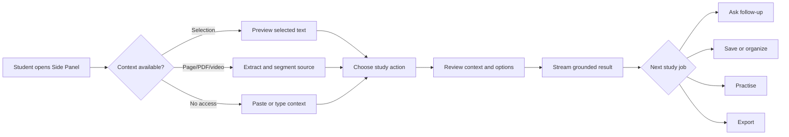

# ClassMate AI — Project Specification

**Version:** 1.0.0  
**Purpose:** Define the product vision, users, scope, behavior, quality bar, and acceptance criteria for a production-grade student study copilot delivered through the Chrome Side Panel.

## Table of Contents

1. [Product Definition](#1-product-definition)
2. [Goals and Success Measures](#2-goals-and-success-measures)
3. [Users and Jobs](#3-users-and-jobs)
4. [Scope](#4-scope)
5. [Core Experiences](#5-core-experiences)
6. [Functional Requirements](#6-functional-requirements)
7. [Non-Functional Requirements](#7-non-functional-requirements)
8. [Permissions and Privacy](#8-permissions-and-privacy)
9. [Error and Edge States](#9-error-and-edge-states)
10. [Acceptance and Release Criteria](#10-acceptance-and-release-criteria)
11. [Examples](#11-examples)
12. [Best Practices](#12-best-practices)
13. [Design Decisions](#13-design-decisions)
14. [Engineering Notes](#14-engineering-notes)
15. [Future Improvements](#15-future-improvements)

## 1. Product Definition

ClassMate AI, “Your Personal AI Study Copilot,” is a privacy-first Chrome extension that transforms the content currently being studied into grounded explanations, notes, assessments, and revision materials without forcing the student to leave the page. Its primary surface is Chrome’s Side Panel. It supports ordinary webpages, documentation, source repositories, research papers, PDFs, YouTube pages, programming tutorials, and authenticated learning-management systems where browser permissions permit access.

ClassMate AI is not a general chat product, a CRM, or a dashboard transplanted into a narrow panel. Every interaction begins with a study job: understand, condense, practise, remember, prepare an answer, organize evidence, or revisit material. The product combines conversational exploration, cited research-style answers, and structured note creation while keeping the source visible.

### 1.1 Product principles

| Principle | Product consequence | Verification |
|---|---|---|
| Student-first | Academic verbs and answer formats are first-class actions | Usability tests use real study tasks |
| In-context | Side Panel remains available while the source stays visible | No core flow requires a new tab |
| Grounded | Source-derived claims link to captured evidence | Citation coverage is measured |
| Free-first | A usable path exists with free Gemini, Groq, OpenRouter, or local Ollama | Fresh account completes core flows without payment |
| Privacy-first | Capture is explicit, minimized, inspectable, and deletable | Permission and data-deletion tests pass |
| Fast | Useful progress appears immediately and generation streams | Performance service levels are monitored |
| Modular | Content extraction, AI providers, storage, and presentation have contracts | Provider and extractor contract tests pass |
| Calm | The UI prioritizes one task and progressive disclosure | Cognitive-load review passes |

### 1.2 Product boundaries

The extension assists learning; it does not guarantee factual correctness, replace primary sources, submit work to an LMS, bypass paywalls or access controls, impersonate a student, or conceal AI use. Exam-answer formats are study templates, not promises that an answer matches an institution’s grading rubric. The product labels generated content, retains citations where available, and encourages verification for consequential work.

## 2. Goals and Success Measures

### 2.1 Product goals

1. Reduce the time from encountering difficult material to obtaining a useful, source-grounded explanation.
2. Turn passive reading into active recall through flashcards, quizzes, viva questions, and revision reminders.
3. Support regional academic answer conventions, including 2-, 5-, 10-, and 16-mark responses, lab records, algorithms, aims, flows, and results.
4. Preserve student agency through editable outputs, transparent context, provider choice, and reversible storage.
5. Deliver a complete free-first experience without architecturally coupling the product to one model vendor.

### 2.2 North-star and guardrail metrics

The north-star metric is **weekly completed study outcomes**: a generated artifact that the learner meaningfully uses by saving, editing, exporting, answering, or revisiting it. Raw message count is not a success metric.

| Category | Metric | Initial target | Guardrail |
|---|---|---:|---|
| Activation | First grounded output within first session | ≥ 65% | Permission denial rate < 20% |
| Value | Weekly completed study outcomes / WAU | ≥ 3 | Unsave rate < 15% |
| Learning | Quiz completion after content generation | ≥ 25% | Answer reveal before attempt < 35% |
| Quality | Supported claims with a valid citation | ≥ 90% when citations requested | Broken citation anchors < 2% |
| Performance | Side Panel interactive p75 | < 1.2 s | p95 < 2.5 s |
| AI latency | First streamed token p75, cloud | < 2.5 s | p95 < 7 s |
| Reliability | Successful generation completion | ≥ 98% excluding user cancellation | Provider fallback loop = 0 |
| Privacy | Confirmed deletion completion | 100% | Sensitive telemetry payloads = 0 |
| Cost | Free-route completion share | ≥ 80% | No paid provider auto-selection |

Metrics are collected only with consent, use pseudonymous identifiers, exclude page bodies and prompts, and are documented in the privacy notice.

## 3. Users and Jobs

### 3.1 Primary personas

| Persona | Context | Primary jobs | Constraints |
|---|---|---|---|
| Undergraduate | Coursework, exams, labs | Understand, prepare mark-based answers, revise | Limited budget; variable connectivity |
| School student | Guided curriculum | Explain simply, memorize, practise | Needs safe language and low complexity |
| Programming learner | Docs, tutorials, repositories | Explain code, derive algorithm, debug concepts | Syntax and version accuracy matter |
| Research reader | Papers and long-form sources | Summarize methods, compare claims, capture citations | PDFs, equations, tables, provenance |
| Competitive-exam learner | High-volume revision | Condense, quiz, spaced review | Fast repetition and organization |

### 3.2 Jobs-to-be-done

- When a paragraph is difficult, explain it at a level I choose and preserve the author’s key qualifications.
- When a chapter is long, create a structured summary with evidence anchors so I can review quickly.
- When an exam approaches, convert saved material into active-recall practice and schedule revision.
- When my university expects a particular answer length, produce a study-ready structure proportionate to the marks.
- When I study code, distinguish source code from prose, preserve formatting, and explain behavior without inventing APIs.
- When I return later or go offline, let me find my saved notes and practice materials.

## 4. Scope

### 4.1 Release scope

| Capability | MVP | V1 | Later |
|---|:---:|:---:|:---:|
| Side Panel, onboarding, quick actions | ✓ | Enhance | — |
| Web selection/page extraction | ✓ | Enhance | — |
| Native PDF extraction | ✓ | OCR fallback | Advanced layout |
| YouTube transcript ingestion | ✓ when available | User transcript import | Audio transcription |
| Summary, explain, chat | ✓ | Enhance | — |
| Flashcards and quiz | ✓ | Analytics | Adaptive practice |
| Mark-based/university formats | ✓ | Institution profiles | Rubric calibration |
| Bookmarks, history, search | ✓ | Semantic search | Knowledge graph |
| Collections, folders, tags | Basic | ✓ | Shared collections |
| Markdown/copy export | ✓ | PDF/Word | Study packages |
| Offline saved notes | ✓ | Offline practice | Local inference UX |
| Gemini/Groq/OpenRouter/Ollama | ✓ | Routing policies | Additional providers |
| Optional account sync | Local-first | ✓ | Collaboration |
| Study analytics and reminders | Basic | ✓ | Adaptive schedules |

### 4.2 Explicitly out of scope for initial releases

Automatic assignment submission, plagiarism evasion, proctoring bypass, page-access circumvention, autonomous browsing across arbitrary sites, social feeds, institutional grading, real-time multi-user editing, and mandatory paid APIs are excluded. Unsupported or protected content is handled transparently rather than circumvented.

## 5. Core Experiences

### 5.1 Context-to-outcome flow

### 5.2 Entry points

- Toolbar action opens the Side Panel for the active tab.
- Context-menu actions operate on selected text: summarize, explain simply, ask, make flashcards.
- Keyboard command opens the panel and focuses the composer; a second command can capture selection where Chrome permits.
- Saved-item and reminder notifications deep-link to the relevant artifact in the panel.
- The panel home detects content type and offers no more than six prioritized actions; all actions remain searchable in the command palette.

### 5.3 Context model

Every conversation turn exposes a compact “Using” control describing its context: selection, section, full page, transcript, PDF pages, saved note, or no source. Students can inspect, remove, or add sources before sending. Context is snapshotted with a hash and metadata at generation time so later page changes do not silently alter provenance.

## 6. Functional Requirements

Requirement IDs are stable and trace into tasks and tests.

### 6.1 Capture and extraction

| ID | Requirement | Acceptance evidence |
|---|---|---|
| FR-CAP-001 | Capture explicit selection before full-page text | Selection preview exactly matches normalized visible text |
| FR-CAP-002 | Extract title, canonical URL, headings, main text, code blocks, lists, tables, and language hints | Contract fixtures pass for supported site families |
| FR-CAP-003 | Exclude navigation, ads, hidden text, scripts, styles, and form secrets | Security fixtures contain none in output |
| FR-CAP-004 | Detect PDF, video, documentation, article, repository, LMS, and generic page classes | Confidence and fallback are shown |
| FR-CAP-005 | Segment long content while retaining heading path and source offsets | Each chunk maps to a resolvable source anchor |
| FR-CAP-006 | Obtain YouTube transcripts only through permitted, available mechanisms | Missing transcript produces recovery options |
| FR-CAP-007 | Never capture password, payment, private-key, or editable form fields | Sensitive-field tests pass |

### 6.2 AI study actions

| ID | Requirement | Key behavior |
|---|---|---|
| FR-AI-001 | Summary | Brief, standard, and detailed levels; key terms; citations |
| FR-AI-002 | Explain | Simple, standard, and deep levels; analogy optional; misconceptions |
| FR-AI-003 | Flashcards | Editable front/back, source anchor, tags, difficulty |
| FR-AI-004 | Quiz | MCQ, multiple-select, true/false, short answer; explanations after attempt |
| FR-AI-005 | Memory tricks | Clearly labels mnemonics and avoids replacing factual content |
| FR-AI-006 | Exam answers | 2/5/10/16-mark structure with proportional depth and configurable style |
| FR-AI-007 | University/lab | Aim, apparatus if relevant, theory, algorithm, flow, procedure, result, viva |
| FR-AI-008 | Chat | Multi-turn, context-visible, citation-capable, cancellable streaming |
| FR-AI-009 | Provider control | Explicit provider/model choice plus free-first automatic route |
| FR-AI-010 | Recovery | Retry, switch provider, shorten context, or use local model without losing draft |

All generated study artifacts carry provider/model metadata, generation time, source set, prompt-template version, and a visible AI-content label. Internal chain-of-thought is neither requested nor displayed; concise explanations and evidence are requested instead.

### 6.3 Library and organization

- History records user-initiated generations locally by default and supports date, action, source type, provider, and status filters.
- Bookmarks reference a source or artifact; collections contain ordered references; folders form an acyclic tree; tags are many-to-many.
- Search covers titles, normalized source metadata, user-authored notes, and generated artifact text. Local lexical search is always available; semantic search is optional and consented.
- A saved artifact is immutable at the generation-revision level. Edits create a user revision while retaining the generated original and provenance.
- Deleting a parent offers clear choices for contained items: delete, move to root, or remove membership. Destructive actions support undo where technically possible.

### 6.4 Export and sharing

Markdown and copy are baseline exports. PDF and Word exports render title, student edits, citations, source list, generated-content disclosure, and creation date. Export is generated on demand and does not upload content unless a server renderer is explicitly selected. Share links are opt-in, expire, can be revoked, reveal their visibility before creation, and never include private source snapshots by default.

### 6.5 Settings

Settings cover theme, language, explanation level, prompt style, answer convention, default action, provider/model, custom endpoint for Ollama, storage mode, synchronization, retention, telemetry consent, shortcuts, reminders, exports, and data management. Provider credentials are validated without logging and stored according to [08_AI_ARCHITECTURE.md](08_AI_ARCHITECTURE.md).

## 7. Non-Functional Requirements

| ID | Domain | Requirement |
|---|---|---|
| NFR-PERF-001 | Startup | Cached panel shell interactive p75 < 1.2 s on reference mid-tier hardware |
| NFR-PERF-002 | Capture | Selection preview p75 < 150 ms; ordinary article extraction p75 < 800 ms |
| NFR-REL-001 | Reliability | User drafts survive panel close, tab switch, worker suspension, and recoverable crashes |
| NFR-SEC-001 | Security | Least-privilege permissions, CSP compliance, sanitization, origin validation, dependency scanning |
| NFR-PRV-001 | Privacy | Data minimization, purpose limitation, deletion, export, retention control, no prompt telemetry |
| NFR-ACC-001 | Accessibility | WCAG 2.2 AA target; keyboard complete; screen-reader semantics; reduced motion |
| NFR-COMP-001 | Compatibility | Current and previous two stable Chrome desktop versions |
| NFR-I18N-001 | Localization | UTF-8, locale-aware formatting, externalized UI strings, RTL-ready layout |
| NFR-MNT-001 | Maintainability | Strict TypeScript, bounded modules, contracts, automated architecture checks |
| NFR-OBS-001 | Observability | Correlated failures and timings without captured or generated study content |

### 7.1 Accessibility details

Focus order follows visual order; focus is restored after dialogs and route changes; streaming announcements are throttled; color never carries meaning alone; controls have accessible names; 200% zoom remains usable at a 360 CSS-pixel panel; touch targets are at least 40×40 CSS pixels where space allows; syntax and diagrams have textual alternatives.

## 8. Permissions and Privacy

Host access is requested at interaction time where practical. `activeTab`, `sidePanel`, `storage`, `contextMenus`, and narrowly justified optional permissions are preferred over blanket host access. The permission rationale is written in student language at the moment it becomes relevant.

### 8.1 Data classes

| Class | Examples | Default handling |
|---|---|---|
| Public source metadata | URL, title, content type | Local; synced only if enabled |
| Captured content | Selection, page text, transcript | Ephemeral unless saved; sent only for chosen generation |
| Student content | Prompts, notes, answers | Local-first; encrypted in transit when synced |
| Credentials | Provider API key, access token | Extension-local protected storage strategy; never synced by app |
| Operational data | Error code, latency, provider class | Consent-based and content-free |
| Derived learning data | Quiz attempts, review schedule | Local-first; account sync optional |

Private/incognito contexts are disabled by default. If the user explicitly enables incognito in Chrome, the product treats it as isolated ephemeral mode and prominently explains storage behavior.

## 9. Error and Edge States

| Condition | User-facing response | Recovery |
|---|---|---|
| Restricted Chrome page | “Chrome does not allow page access here.” | Paste text or open a supported source |
| Empty/visual-only PDF | Explain no selectable text was found | Select OCR/import option when available |
| Transcript unavailable | State that no permitted transcript is available | Paste transcript or use page description |
| Context exceeds model limit | Show what will be condensed and its coverage | Narrow section, hierarchical summary, or another model |
| Provider quota/rate limit | Preserve draft and partial output | Retry after indicated delay or switch free route |
| Network lost mid-stream | Mark output incomplete | Resume if supported or retry from saved request |
| Citation cannot resolve | Mark citation as unavailable, never fabricate | Open source and re-capture |
| Source changed | Show snapshot-time warning | Refresh context with explicit confirmation |
| Storage quota reached | Explain affected storage class | Export, delete, or enable sync; never silently discard |
| Unsafe prompt injection in page | Treat page instructions as untrusted source text | Exclude suspicious segments and notify when material |

## 10. Acceptance and Release Criteria

A release candidate is eligible only when all critical and high requirements in scope have automated or documented manual evidence; zero open critical security defects; privacy review completed; keyboard-only and screen-reader smoke tests pass; Chrome Web Store disclosures match actual behavior; fresh-install, upgrade, offline, worker-suspension, and provider-failure journeys pass; database migrations have rollback or forward-repair procedures; and incident owners, dashboards, and rollback artifacts exist.

### 10.1 Definition of a complete feature

A feature includes empty/loading/error/offline states, accessibility, localization readiness, analytics decision, privacy assessment, unit/contract/integration coverage, user documentation, migration implications, and operational ownership. A happy-path component alone is not complete.

## 11. Examples

### 11.1 Difficult paragraph

A student selects a paragraph in an MDN article, chooses **Explain simply**, verifies “Selected text · MDN” in the context chip, and receives a streamed explanation with definitions, a short analogy, one caveat, and citations that scroll the source page to the relevant text. They convert the explanation to four flashcards and save them to “Web APIs.”

### 11.2 University answer

A student chooses a section of lecture notes, selects **10 marks**, language “English,” and style “University structured.” The artifact contains a definition, logically ordered headings, a diagram description where useful, an example, and a conclusion at a configurable target length. A notice says the format is a study aid and should be checked against the university rubric.

### 11.3 Provider outage

Groq returns a rate limit after partial output. The panel keeps the draft, labels the response incomplete, and presents “Retry in 22 s,” “Use Gemini,” and “Use Ollama.” Switching providers creates a new attempt under the same request; it does not append incompatible fragments to the old output.

## 12. Best Practices

- Prefer explicit source scope over invisible automatic capture.
- Make the primary action useful with defaults; put advanced controls behind progressive disclosure.
- Preserve student edits and drafts across every recoverable failure.
- Use recognition over recall: recent sources, named collections, visible context, and action history.
- Measure learning-oriented outcomes, not engagement for its own sake.
- Label uncertainty and missing evidence plainly.
- Test with low-end hardware, narrow panels, long sources, non-English text, and intermittent networks.

## 13. Design Decisions

| Decision | Rationale | Rejected alternative |
|---|---|---|
| Side Panel as primary UI | Maintains source visibility and supports sustained work | Popup: too small and closes on blur |
| Local-first library | Immediate privacy, offline use, and fast retrieval | Mandatory account: harms activation and free-first promise |
| Artifact model | Structured outputs enable editing, practice, export, and provenance | Chat-only transcript: hard to reuse |
| Explicit context control | Builds trust and reduces accidental disclosure | Background continuous capture |
| Provider abstraction | Availability, cost control, and user choice | One-vendor SDK throughout product |
| Citations to source spans | Supports verification without leaving study flow | Unanchored source list |
| Free-first router | Makes the core product genuinely usable without payment | Trial credits presented as free operation |

## 14. Engineering Notes

Chrome Manifest V3 service workers are suspendable; durable workflow state must not depend on in-memory globals. Side Panel lifecycle differs from ordinary tabs, and active-tab changes require re-evaluating context without discarding the current draft. LMS and repository pages are highly dynamic; extractors must use stable semantic strategies and a generic fallback. AI token limits are budgets, not character limits; segmentation stores token estimates per provider family. Every artifact format has a versioned schema so saved local data, synced data, prompts, and renderers can evolve independently.

## 15. Future Improvements

Potential improvements include adaptive spaced repetition, knowledge maps across saved sources, on-device embeddings, optional local OCR, collaborative study packs, institution-specific rubric profiles, citation-aware paper comparison, voice interaction with accessible transcripts, diagram generation with source-linked claims, and federated or privacy-preserving learning analytics. Each addition requires a fresh privacy, abuse, accessibility, cost, and free-first review before entering scope.
