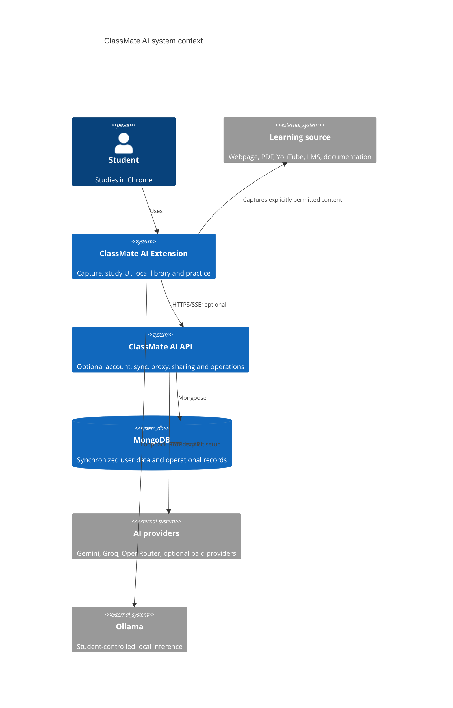
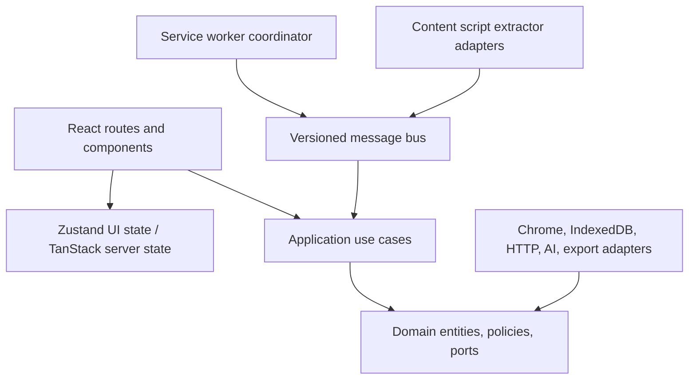
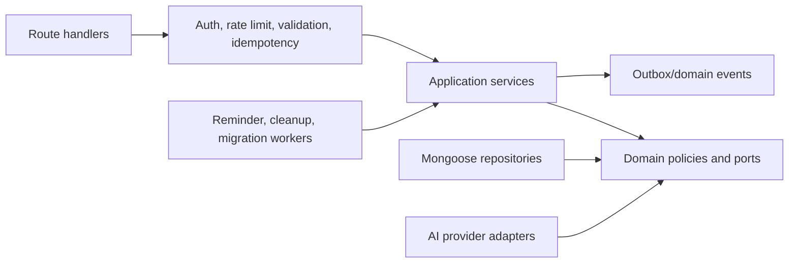
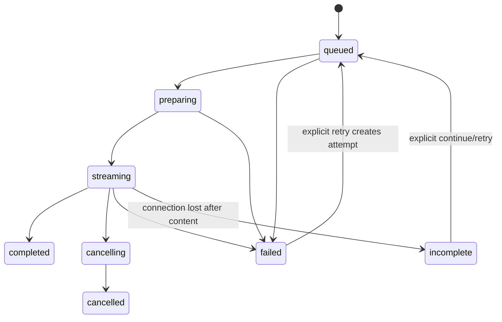
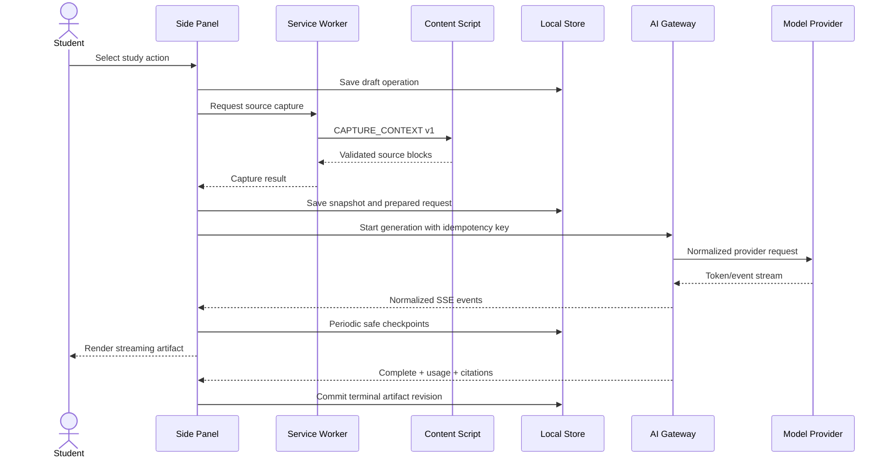
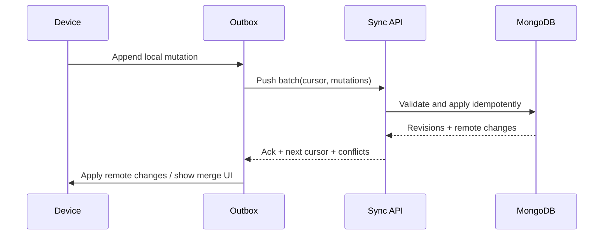

# ClassMate AI — System Architecture

**Version:** 1.0.0  
**Purpose:** Specify the production architecture, component boundaries, runtime flows, reliability model, security boundaries, deployment topology, and architectural rationale.

## Table of Contents

1. [Architecture Drivers](#1-architecture-drivers)
2. [System Context](#2-system-context)
3. [Extension Architecture](#3-extension-architecture)
4. [Backend Architecture](#4-backend-architecture)
5. [Shared Domain and Contracts](#5-shared-domain-and-contracts)
6. [Key Runtime Flows](#6-key-runtime-flows)
7. [Storage and Synchronization](#7-storage-and-synchronization)
8. [Security Architecture](#8-security-architecture)
9. [Reliability and Observability](#9-reliability-and-observability)
10. [Deployment and Environments](#10-deployment-and-environments)
11. [Examples](#11-examples)
12. [Best Practices](#12-best-practices)
13. [Design Decisions](#13-design-decisions)
14. [Engineering Notes](#14-engineering-notes)
15. [Future Improvements](#15-future-improvements)

## 1. Architecture Drivers

The strongest drivers are Manifest V3’s suspendable service worker, narrow Side Panel UX, privacy-sensitive source capture, free-provider variability, long-context processing, offline library access, optional account synchronization, streamed model output, and independent schema evolution. The architecture is a modular monorepo with ports-and-adapters boundaries, not distributed microservices.

Quality priorities, in order, are privacy/security, correctness and data durability, availability of a free route, responsiveness, accessibility, maintainability, and cost efficiency.

## 2. System Context

The extension remains useful without the API for local storage and direct/local provider configurations. The backend adds synchronized library, secure server-side provider proxying, share links, reminder delivery, centralized routing metadata, and operational controls.

## 3. Extension Architecture

### 3.1 Runtime contexts

| Context | Responsibilities | Prohibited responsibilities |
|---|---|---|
| Side Panel React app | Presentation, local interaction, application commands, streaming display | Direct DOM access to source tab; raw provider SDK use |
| Service worker | Privileged Chrome APIs, routing messages, context-menu commands, alarms, durable workflow coordination | Durable in-memory state; UI rendering |
| Content script | Explicit extraction, selection capture, source-anchor resolution | Credentials, model calls, arbitrary script execution |
| Offscreen document, optional | DOM-only transformations explicitly unsupported in worker | Persistent hidden application or surveillance |
| IndexedDB adapter | Local artifacts, sources, attempts, search index, outbox | Business policy |

### 3.2 Extension layers

The Side Panel does not assume the service worker remains awake. Commands carry correlation and idempotency IDs. Before starting capture or generation, recoverable request state is stored locally. Progress can be reconstructed from persisted state and, for server streams, a resumable operation status endpoint.

### 3.3 Content extraction pipeline

1. Validate requesting extension context and active tab.
2. Classify URL, document type, and restricted-page status.
3. Prefer explicit selection; otherwise run site-family extractor then generic readability adapter.
4. remove hidden, interactive, secret-like, navigation, ad, script, and style content.
5. Normalize Unicode and whitespace while preserving semantic block types.
6. Assign stable block IDs, heading paths, DOM/text anchors, and source offsets.
7. Classify and redact likely secrets or sensitive form remnants.
8. Return metadata and bounded content; segment/tokenize in the application pipeline.

Extractors are deterministic and do not call models. Site-specific adapters are optional enhancements behind a common contract; failure falls back to generic extraction.

### 3.4 State ownership

| State | Owner | Persistence |
|---|---|---|
| Open menus, draft visual mode | Component/Zustand | Session, selected fields checkpointed |
| Composer draft and active request | Study session repository | IndexedDB |
| Local library and practice | Local repositories | IndexedDB |
| Remote account records | TanStack Query cache + API | Server; cache persisted selectively |
| Provider credentials | Credential vault adapter | Device-only extension storage strategy |
| Theme/simple preferences | Settings repository | Local; non-sensitive subset may use Chrome sync |
| Capture workflow | Durable operation record | IndexedDB, coordinated by worker |

## 4. Backend Architecture

The backend is a Next.js App Router modular monolith. Route handlers are delivery adapters. Application services coordinate domain operations and repository ports. Mongoose repositories own persistence mapping. Provider adapters own vendor protocols. This offers transactional clarity and inexpensive deployment while retaining extraction boundaries for future scaling.

### 4.1 Bounded modules

| Module | Owns |
|---|---|
| Identity | Account, sessions, refresh rotation, deletion state |
| Library | Sources, artifacts, revisions, bookmarks, folders, collections, tags |
| Study | Threads, messages, generation operations, citations, prompt selections |
| Practice | Flashcard decks, quiz attempts, scheduling, learning events |
| AI Gateway | Model catalog, routing, quotas, normalized streams and usage |
| Export/Sharing | Export jobs, signed downloads, expiring share snapshots |
| Notifications | Revision reminders, delivery preferences and receipts |
| Operations | Audit events, flags, privacy jobs, health and telemetry |

Cross-module access uses application contracts, never direct model imports. MongoDB transactions are used only for invariants spanning multiple documents; most writes use aggregate-local atomicity plus outbox processing.

## 5. Shared Domain and Contracts

Shared packages contain schemas and dependency-free types for content blocks, source snapshots, study actions, artifacts, citations, provider capabilities, operation events, API envelopes, and extension messages. “Shared” does not include UI components, Mongoose models, environment access, or provider SDK objects.

### 5.1 Principal entities

- **SourceSnapshot:** immutable captured content, canonical metadata, hash, blocks, anchors, capture time, sensitivity result.
- **Artifact:** typed generated study object with provenance and immutable generated revisions.
- **StudyThread:** ordered user/model turns and attached source references.
- **GenerationOperation:** durable state machine for a provider attempt.
- **PracticeItem/Attempt:** flashcard or question plus student response and scheduling outcome.
- **LibraryNode:** folder/collection/tag organization without duplicating artifact content.

### 5.2 Operation state machine

Terminal states are immutable. A retry is a new attempt linked to the original operation, which prevents ambiguous usage accounting and mixed-provider output.

## 6. Key Runtime Flows

### 6.1 Capture and direct/provider-proxy generation

For direct Gemini/Groq/OpenRouter mode, the extension-side gateway implements the same normalized port. Direct mode is opt-in because the key resides on the device and source content goes from extension to provider. Ollama uses an explicit loopback endpoint allowlist and connection test.

### 6.2 Synchronization

Local changes receive UUIDs, schema version, logical revision, device ID, and modified time. The outbox sends idempotent mutations in order per aggregate. Server responses include authoritative revision and cursor. Conflicts use field/aggregate rules: notes require user-visible merge, tags/collection membership use set semantics, deletes use tombstones, and immutable generation revisions never conflict.

## 7. Storage and Synchronization

IndexedDB is the authoritative device store for local-first artifacts. Chrome storage is reserved for small settings and secure-device credential strategy; LocalStorage is not an application database. Large snapshots use compression only after profiling and remain searchable through derived indexes. The server stores synchronized records but not unsaved ephemeral capture.

Retention defaults: ephemeral capture until operation completion plus a short crash-recovery window; local history according to user setting; server soft-delete tombstones 30 days; operational safe logs 30–90 days; refresh-session records until expiry/revocation; share snapshots until expiry or revocation. Exact policies are exposed in settings and privacy documentation.

## 8. Security Architecture

### 8.1 Trust boundaries

| Boundary | Threats | Controls |
|---|---|---|
| Page → content script | Prompt injection, hostile DOM, oversized content | Deterministic extraction, delimiting, bounds, sanitization |
| Content script → worker/panel | Forged messages, stale tab/frame | Sender validation, schemas, nonce/correlation, active-tab checks |
| Model → renderer | XSS, unsafe links, invented citations | Markdown allowlist, URL policy, typed artifacts, citation validation |
| Extension → API | Token theft, replay | TLS, short access token, rotation, audience, idempotency |
| API → provider | Secret leakage, quota abuse | Vaulted keys, redaction, per-user limits, provider allowlist |
| Ollama loopback | DNS rebinding/endpoint abuse | Explicit localhost schemes/ports, no credential forwarding, connection consent |

The API applies defense in depth: content-length limits, Zod validation, authentication, ownership authorization, rate limits, idempotency, safe error mapping, security headers, and audit events for sensitive actions. Model content has no authority to initiate Chrome or backend tools.

## 9. Reliability and Observability

### 9.1 Reliability mechanisms

- Idempotency keys protect create/generate/export/sync retries.
- Exponential backoff with jitter is bounded by provider retry hints and user cancellation.
- Circuit breakers prevent repeatedly selecting an unhealthy provider.
- Bulkheads separate provider concurrency and background jobs.
- Durable outbox records sync/notification events before acknowledgment.
- Partial streams checkpoint at safe block boundaries without claiming completion.
- Schema migrations are additive, resumable, and instrumented.

### 9.2 Observability

Traces propagate correlation ID from extension operation through API and provider adapter. Metrics include request latency, first-token latency, completion ratio, normalized error category, fallback count, token usage, sync lag, outbox age, storage quota, and reminder delay. Logs contain IDs and classifications, not prompt/source/generated bodies. Health endpoints distinguish liveness, readiness, and dependency degradation.

SLOs include 99.9% API availability monthly, 98% generation completion excluding cancellation/provider-wide free-tier exhaustion, sync p95 under 10 seconds when online, and zero acknowledged mutation loss. Error budgets govern feature rollout.

## 10. Deployment and Environments

Environments are local, test, staging, and production with separate databases, OAuth/JWT issuers, encryption keys, provider credentials, flags, and telemetry projects. Production data never enters lower environments. Seed data is synthetic.

The extension is built as a deterministic MV3 bundle with environment-specific public API origin and signed store artifact. The Next.js application deploys as a Node-compatible service because streaming, Mongoose connection management, and cryptography require predictable runtime support. Background jobs may share the codebase but run as separately scalable processes. MongoDB uses replica-set capabilities, point-in-time backup, and least-privilege users.

## 11. Examples

### 11.1 Worker suspension

The service worker is terminated after dispatching capture. The Side Panel observes no completion, reads the operation record, checks whether the tab/capture nonce is still valid, and safely retries. The content snapshot hash prevents duplicate records. No draft disappears.

### 11.2 Provider fallback

Automatic routing selects Gemini free. A normalized `RATE_LIMITED` response opens its circuit temporarily. If policy permits, the router chooses Groq with sufficient context and capability. A new attempt records both decisions. It never escalates to a paid OpenAI model unless the student explicitly enabled paid fallback.

## 12. Best Practices

- Make runtime boundaries visible through contracts and contract tests.
- Keep source snapshots immutable; derive new snapshots when the page changes.
- Persist intent before external effects.
- Prefer modular-monolith transactions and events over premature services.
- Design every network flow for retry, duplication, cancellation, and late arrival.
- Store normalized provider metadata while preserving safe raw codes only for diagnostics.

## 13. Design Decisions

| Decision | Why | Consequence |
|---|---|---|
| Modular monorepo | Shared contracts and atomic evolution without deployment sprawl | Boundary linting is mandatory |
| IndexedDB local-first | Offline, privacy, capacity, structured queries | Sync/conflict logic is explicit |
| Backend optional for core | Free-first resilience and user agency | Two AI gateway adapters must pass the same suite |
| Immutable snapshots/revisions | Provenance and safe sync | Storage cleanup policies matter |
| SSE for generation | Simple one-way streaming and proxy compatibility | Resume/status endpoint covers disconnects |
| Durable operation state machine | MV3 suspension and reliable recovery | More explicit records, fewer hidden states |

## 14. Engineering Notes

Use Web Streams end-to-end and avoid buffering model responses in route handlers. Mongoose connections are cached per runtime instance with bounded pool settings. Extension CSP excludes remote scripts and unsafe evaluation. Build aliases cannot bypass package exports. Architecture decision records are required for new runtimes, persistence technologies, permissions, provider protocol changes, or cross-module dependencies.

## 15. Future Improvements

Scale triggers—not fashion—may extract AI gateway or notification workers into services. Other candidates include on-device embeddings, encrypted local search, CRDT-based note collaboration, WebGPU/local inference, resumable object uploads for large documents, regional data residency, and event-stream analytics. Each change preserves the domain ports and privacy model.
