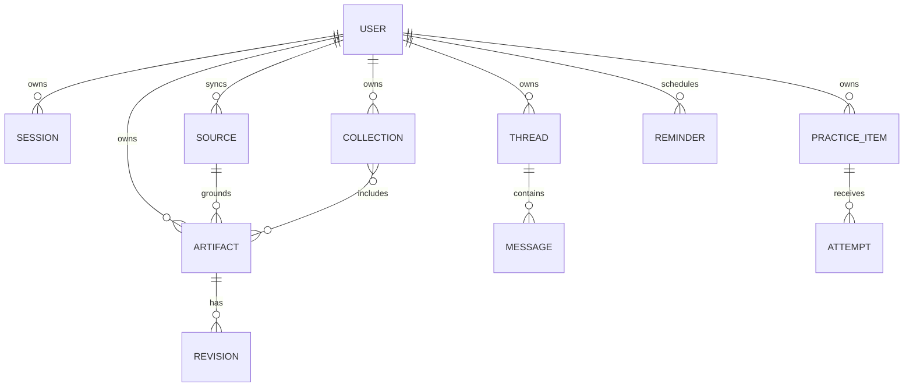

# ClassMate AI — Data and Database Specification

**Version:** 1.0.0  
**Purpose:** Specify MongoDB and local IndexedDB data models, constraints, indexes, synchronization, lifecycle, migrations, backup, and privacy behavior.

## Table of Contents

1. [Data Architecture](#1-data-architecture)
2. [Conventions](#2-conventions)
3. [Server Collections](#3-server-collections)
4. [Relationships and Invariants](#4-relationships-and-invariants)
5. [Indexes](#5-indexes)
6. [Local Database](#6-local-database)
7. [Synchronization and Conflicts](#7-synchronization-and-conflicts)
8. [Retention, Deletion, and Privacy](#8-retention-deletion-and-privacy)
9. [Migrations, Backup, and Operations](#9-migrations-backup-and-operations)
10. [Examples](#10-examples)
11. [Best Practices](#11-best-practices)
12. [Design Decisions](#12-design-decisions)
13. [Engineering Notes](#13-engineering-notes)
14. [Future Improvements](#14-future-improvements)

## 1. Data Architecture

IndexedDB is authoritative for device-local mode; MongoDB is authoritative for synchronized account data. Chrome storage contains only small preferences and device credential metadata. Source snapshots are immutable; user edits are revisions; organization is by references so an artifact can belong to multiple collections without duplication.

## 2. Conventions

All records have `_id`, public `id` (UUID/ULID), `schemaVersion`, `createdAt`, `updatedAt`, and where synchronized, `revision`, `deviceId`, and optional `deletedAt`. Dates are UTC BSON dates. User-visible ordering uses explicit rank/order fields, not creation time. URLs are canonicalized; a separate display URL may preserve readable form. Text normalization never changes the immutable raw capture without retaining provenance.

Mongoose validation complements, but does not replace, Zod boundary validation. Unknown fields are rejected for mutation input. Optimistic updates match owner + public ID + expected revision atomically.

## 3. Server Collections

### 3.1 `users`

| Field | Type | Constraint/purpose |
|---|---|---|
| `id` | string | Unique public identifier |
| `emailNormalized` | string | Unique sparse; encrypted or minimized as policy requires |
| `passwordHash` | string | Optional auth method; strong adaptive hash |
| `roles` | string[] | Allowlisted; default `student` |
| `locale`, `timeZone` | string | Validated preferences |
| `settings` | object | Versioned, non-secret synchronized settings |
| `accountState` | enum | active, locked, deletion-pending |
| `deletionRequestedAt` | date? | Privacy workflow |

Provider API keys are not stored in the user document. If server-managed user keys are supported, encrypted credential envelopes live in a separately permissioned collection with key ID and rotation metadata.

### 3.2 `sessions`

Stores hashed refresh-token family identifiers, user ID, device label, issued/last-used/expiry dates, rotation counter, revoked date/reason, and reuse detection state. Raw refresh tokens are never stored. TTL removes expired sessions after an audit-safe interval.

### 3.3 `sources`

Stores owner, canonical URL hash/display metadata, source type, title, author/domain, captured time, content hash, language, block manifest, source size, extraction version, sensitivity flags, and optional compressed content. Server content exists only when sync/save is enabled. Duplicate content can be deduplicated per owner by content hash while preserving capture events.

### 3.4 `artifacts` and `artifact_revisions`

`artifacts` stores owner, type, title, active revision ID, source references, generation provenance, tags cache, pin/archive state, search projection, and deletion metadata. Revisions store immutable generated payload or editable user payload, parent revision, editor class (`model` or `user`), schema version, citations, prompt-template version, provider/model, and hash. Large revision history may be bounded by user policy, but generated originals referenced by active user edits are retained.

### 3.5 `threads`, `messages`, and `generation_operations`

Threads store owner, title, source set, latest-message time, and status. Messages store role, safe structured content, artifact reference, source references, sequence number, and generation operation. Operations store idempotency key, action, routing decision, provider/model, state, timestamps, normalized error, usage, attempt linkage, and safe diagnostics. Ephemeral partial tokens are not indefinitely retained.

### 3.6 Organization

`folders` form an owner-scoped tree through `parentId`; application validation prevents cycles and caps depth. `collections` store owner, name, description, optional folder, and ordering. Membership uses a separate `collection_items` collection when item counts can grow, with unique `(collectionId, targetType, targetId)`. `tags` have normalized owner-scoped names; `taggings` support many-to-many targets.

### 3.7 Practice and reminders

`practice_items` store artifact/source link, type, prompt/front, answer/back, accepted answers, difficulty, citation references, scheduling state, and suspension. `attempts` are append-only with response classification, score, duration, hints, and schedule transition. `reminders` store local time intent, IANA timezone, recurrence, next occurrence, target, delivery channels, and state. Delivery receipts prevent duplicate notification.

### 3.8 Sharing, jobs, and audit

Share records contain opaque token hash, owner, immutable snapshot reference, visibility, expiry, revocation, and access count; raw share tokens are returned once. Export jobs contain format, state, safe options, object reference, expiry, and error class. Audit events cover authentication/security/privacy actions using safe metadata. An outbox collection stores domain events atomically with state changes for reliable processing.

## 4. Relationships and Invariants

- Every user-owned query includes owner ID; public IDs alone never authorize access.
- A revision belongs to exactly one artifact; its parent belongs to that artifact.
- Active revision must exist and not be deleted.
- Citation chunk IDs must belong to an artifact source snapshot.
- Folder ancestry cannot contain self and depth cannot exceed the configured limit.
- Collection membership is unique and deleting a collection does not delete its items.
- Completed/cancelled/failed operation states are terminal; retries create linked operations.
- Practice attempts are append-only; schedule state is updated atomically with the attempt or recoverably via event.
- Tombstones win over stale updates unless the student explicitly restores.

## 5. Indexes

| Collection | Index | Purpose |
|---|---|---|
| users | unique `id`; unique sparse `emailNormalized` | Identity |
| sessions | `userId, revokedAt`; TTL `expiresAt` | Device/session management |
| sources | `userId, contentHash`; `userId, capturedAt desc` | Dedup/recent |
| artifacts | `userId, updatedAt desc`; `userId, type, updatedAt`; text/search projection | Library/search |
| revisions | unique `artifactId, revisionNumber` | Ordered history |
| messages | unique `threadId, sequence`; `userId, createdAt` | Thread ordering |
| operations | unique `userId, idempotencyKey`; `state, updatedAt` | Retry/recovery |
| collection_items | unique collection-target tuple; `targetId` | Membership |
| attempts | `userId, practiceItemId, createdAt`; `userId, createdAt` | Analytics |
| reminders | partial `state, nextOccurrence` | Scheduler |
| shares | unique `tokenHash`; TTL `expiresAt` | Public lookup/expiry |
| outbox | `status, availableAt`; unique `eventId` | Delivery |

Index use is verified with representative explain plans. Unbounded compound indexes are avoided; low-cardinality leading fields are used only with selective companions.

## 6. Local Database

IndexedDB stores: `sources`, `artifacts`, `revisions`, `threads`, `messages`, `practiceItems`, `attempts`, `settings`, `operations`, `outbox`, `syncMeta`, and derived `searchIndex`. Each store has a versioned codec validated on read. Corrupt records are quarantined with safe metadata and export/recovery options.

Local search uses normalized tokens and postings to artifact IDs; it excludes credentials and can be rebuilt. Storage estimates are monitored. Cleanup removes expired ephemeral captures, abandoned partial streams, old caches, and unused source bodies while retaining saved artifact integrity. Quota pressure is shown before data loss.

## 7. Synchronization and Conflicts

Each mutation includes mutation ID, aggregate ID/type, base revision, operation, payload schema, device ID, and client time. Server keeps idempotency receipts long enough for retry windows. Pull uses an opaque cursor over a server change sequence.

| Data | Conflict policy |
|---|---|
| Immutable revision/attempt | Union by unique ID |
| Tags/membership | Add/remove set with tombstones |
| Settings | Per-field last accepted update; sensitive choices require confirmation |
| Note text/title | Preserve both and request user merge |
| Folder move | Server validates tree; losing move surfaced |
| Delete vs update | Delete wins; restore creates a new revision |

Sync is optional, encrypted in transit, pauseable, and observable. Signing out never silently deletes device-local data; the user chooses retain or remove.

## 8. Retention, Deletion, and Privacy

| Data | Default retention | Deletion behavior |
|---|---|---|
| Unsaved capture | Operation + crash-recovery window | Automatic purge |
| Saved source/artifact | Until user deletion | Tombstone then purge after 30 days |
| Generation diagnostic | 30 days, content-free | Automatic purge |
| Session | Expiry/revocation + audit interval | TTL |
| Share/export | Until expiry or revocation | Immediate access denial, async object purge |
| Audit security event | Policy-defined, typically 90–365 days | Restricted purge workflow |
| Account | Pending cooling-off if disclosed, then cascade/anonymize | Verifiable privacy job |

Deletion jobs are idempotent and produce a completion record. Backups age out deleted data through the documented backup retention; restoration procedures reapply deletion ledgers.

## 9. Migrations, Backup, and Operations

Use expand-migrate-contract: deploy readers tolerant of old/new fields, add new fields/indexes, backfill in bounded resumable batches, switch writes, verify, then remove legacy fields after the compatibility window. Every migration records version, cursor, counts, errors, start/finish, and checksum.

MongoDB point-in-time backup targets RPO ≤ 15 minutes and RTO ≤ 4 hours initially. Quarterly restore exercises verify document counts, critical invariants, indexes, encryption keys, and deletion-ledger replay. Local IndexedDB upgrades use transactions per store where possible and preserve an export path before destructive transformation.

## 10. Examples

Two devices edit the same note from revision 7. Device A syncs revision 8. Device B submits base 7; the server returns a conflict with both versions. The extension creates a merge artifact and does not overwrite either text. By contrast, concurrent collection additions simply converge by membership ID.

A duplicate generate request with the same idempotency key returns the original operation. A deliberate retry after failure uses a new key and `retryOf`, preserving accurate attempts and usage.

## 11. Best Practices

- Model invariants explicitly and enforce them at application and database boundaries.
- Embed bounded data read together; reference unbounded or independently changing data.
- Project only required fields and paginate every collection endpoint.
- Treat indexes as production resources with write/storage costs.
- Test migrations against realistic scale and interruption.
- Keep analytics derived and deletable, not a second undocumented source of truth.

## 12. Design Decisions

MongoDB fits evolving typed artifacts and source metadata, while separate revision/attempt collections prevent unbounded documents. IndexedDB supports large structured offline data better than Chrome storage. Owner-scoped duplication is favored over cross-user content deduplication to reduce privacy leakage. Soft delete exists for sync/recovery, followed by mandatory purge.

## 13. Engineering Notes

Use Mongoose lean reads for query projections, transactions only on replica sets and genuine multi-document invariants, and bounded pools. Never expose Mongo `_id` externally. Normalize text before search indexing but retain original student text. Monitor document size, index utilization, replication lag, slow queries, connection saturation, outbox age, and deletion backlog.

## 14. Future Improvements

Possible additions include client-side encrypted sync, Atlas Search or provider-neutral full-text service, vector indexes for opt-in semantic search, regional partitions, archival object storage for large source snapshots, and CRDT notes. Each requires updated threat modeling and deletion semantics.
