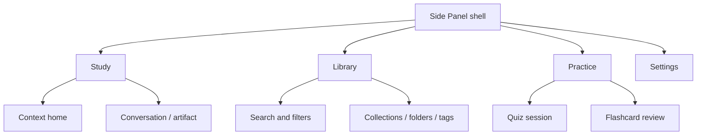

# ClassMate AI — UI Guidelines

**Version:** 1.0.0  
**Purpose:** Define the visual system, interaction patterns, accessibility behavior, content language, and responsive rules for a dark-first Chrome Side Panel study experience.

## Table of Contents

1. [Experience Model](#1-experience-model)
2. [Information Architecture](#2-information-architecture)
3. [Design Tokens](#3-design-tokens)
4. [Layout and Responsiveness](#4-layout-and-responsiveness)
5. [Components](#5-components)
6. [Core Screens and Flows](#6-core-screens-and-flows)
7. [Interaction and Motion](#7-interaction-and-motion)
8. [Content Design](#8-content-design)
9. [Accessibility](#9-accessibility)
10. [States and Feedback](#10-states-and-feedback)
11. [Examples](#11-examples)
12. [Best Practices](#12-best-practices)
13. [Design Decisions](#13-design-decisions)
14. [Engineering Notes](#14-engineering-notes)
15. [Future Improvements](#15-future-improvements)

## 1. Experience Model

The interface is a focused workbench beside the source. It should feel intelligent without looking theatrical: dense enough for serious study, calm enough for long sessions, and explicit about what content and model are being used. Chat is one interaction pattern within a larger artifact workspace.

### 1.1 UX principles

| Principle | Application |
|---|---|
| Source stays sovereign | Context controls and citations remain visible; outputs do not masquerade as source text |
| One clear next action | Each state emphasizes the most likely study job |
| Progressive power | Defaults are immediate; length, level, style, and provider live one layer deeper |
| Preserve momentum | Drafts, partial streams, scroll position, and edits survive interruptions |
| Visible system state | Capture, generation, save, offline, provider, and sync states are never implicit |
| Student language | “Make flashcards,” not “instantiate learning objects” |

## 2. Information Architecture

Primary destinations are **Study**, **Library**, **Practice**, and **Settings**. On narrow panels they appear in a compact bottom rail; at wider sizes they use a labeled left rail. Search and command palette are global. History is a Library view, not a competing primary destination.

## 3. Design Tokens

Tokens are semantic CSS variables consumed through Tailwind and shadcn/ui. Components never embed raw brand colors.

### 3.1 Color

| Token | Dark theme intent | Light theme intent |
|---|---|---|
| `background` | Near-black blue-gray, not pure black | Warm neutral white |
| `surface-1` | Primary panels | Cards against page |
| `surface-2` | Elevated controls and hover | Subtle elevation |
| `foreground` | High-emphasis text | Ink-neutral text |
| `muted-foreground` | Metadata; still AA compliant | Secondary text |
| `primary` | Cool indigo-violet action | Deeper accessible indigo |
| `accent` | Context and learning progress | Subtle tinted surface |
| `success/warning/danger/info` | Semantic feedback with paired icon/text | Same semantics |
| `border/focus-ring` | Separators / unmistakable focus | Separators / focus |

Contrast targets are 4.5:1 for ordinary text, 3:1 for large text and meaningful graphical objects, and at least 3:1 for focus indicators against adjacent colors. Glass surfaces use translucency only when text contrast remains stable; an opaque fallback is mandatory.

### 3.2 Typography

The UI font is a highly legible system or bundled variable sans; code uses a bundled/system monospace. No font is fetched remotely by the extension. Base text is 14–16 px depending on density preference, with 1.5–1.65 line height for reading. Long-form generated content uses a measure of 55–75 characters when panel width permits.

| Role | Size/weight guidance | Use |
|---|---|---|
| Display | 24/650 | Empty/home greeting only |
| Title | 20/650 | View title |
| Section | 16/600 | Artifact sections |
| Body | 14/400 | UI and compact reading |
| Reading | 15/400 | Generated prose and notes |
| Label | 12/550 | Controls and metadata |
| Caption | 11–12/450 | Timestamps and provenance |

### 3.3 Spacing, shape, and elevation

Use a 4 px base grid: 4, 8, 12, 16, 20, 24, 32, and 40. Side-panel horizontal padding is 12 px under 400 px width, 16 px from 400–559, and 20 px above 560. Radii are 8 px for compact controls, 12 px for cards, and 16 px for prominent composer/artifact containers. Shadows are restrained; borders and surface shifts establish most hierarchy.

## 4. Layout and Responsiveness

Chrome permits substantial Side Panel width variation. Design for 320–800+ CSS pixels and zoom to 200%.

| Width | Navigation | Content behavior |
|---:|---|---|
| 320–399 | Icon bottom rail; labels exposed accessibly | Single column, compact actions, sheets full width |
| 400–559 | Labeled bottom rail | Single column, two-column quick-action grid where readable |
| 560–719 | Compact left rail | Content and optional inspector drawer |
| ≥ 720 | Labeled left rail | Split artifact/content inspector when useful |

The header and composer may be sticky but must not trap excessive vertical space. The composer grows to a capped height, then scrolls internally. Safe-area and browser zoom behavior are tested. No horizontal scrolling is allowed except code, wide tables, or intentional carousels with explicit affordances.

## 5. Components

### 5.1 Shell

The shell includes navigation, current view, global status, toast region, command palette, and modal/sheet roots. Route transitions preserve the Study draft. A compact offline/provider indicator appears only when actionable.

### 5.2 Context bar

The context bar answers “What will the AI use?” It displays content-type icon, source title, scope, approximate size, and remove/inspect controls. Multiple sources collapse into “3 sources” with an accessible popover. Warning states include stale snapshot, truncated context, unsupported source, and potential sensitive content.

### 5.3 Quick-action card

Cards use a verb title, one-line result description, icon, and optional shortcut. The default home set is Summary, Explain, Flashcards, Quiz, Exam Answer, and Ask. Frequency does not reorder actions silently; personalization is explicit.

### 5.4 Composer

The composer contains auto-growing input, context attachment, action/prompt menu, send/cancel, and compact provider access. Enter sends by default; Shift+Enter inserts a line break, configurable for accessibility. During streaming, Send becomes Stop. A failed request leaves the exact draft and settings recoverable.

### 5.5 Artifact renderer

Artifacts render typed structures rather than arbitrary visual model instructions. Supported blocks include headings, prose, lists, callouts, citations, tables, math fallback, code, flashcards, questions, answer sections, and lab sections. User edits and generated originals remain distinguishable in revision history.

### 5.6 Citations

Citation markers are keyboard-focusable buttons such as `[1]`. Activating one previews the quoted evidence and provides “Show on page.” Hover-only behavior is forbidden. Unavailable anchors are visibly disabled with a reason.

### 5.7 Markdown and code

Markdown is sanitized. Links show external-destination treatment and never receive opener access. Code blocks show language, wrap toggle, copy, and horizontal scroll. Shiki themes match application themes; code rendering is lazy and has a plain-text fallback.

### 5.8 Practice components

Flashcards reveal on explicit action, preserve keyboard focus, and offer Again/Hard/Good/Easy after reveal. Quiz choices use semantic form controls; correctness is not disclosed until submission unless practice mode says otherwise. Explanations cite source evidence.

## 6. Core Screens and Flows

### 6.1 First run

First run contains: value proposition; how page access works; local-first statement; provider setup with “Use a free cloud provider,” “Connect local Ollama,” and “Explore without AI”; and a guided selection exercise. Permission requests occur only when the relevant step is invoked. Setup is resumable and skippable.

### 6.2 Study home

The home screen leads with detected context, then quick actions, recent continuation, and a compact composer. When no content is accessible it explains why and offers paste/import. It does not display empty analytics or dashboard charts.

### 6.3 Generating

The view immediately inserts a response frame, announces “Generating,” and streams content without repeatedly moving focus. A subtle activity indicator and Stop action remain visible. Auto-scroll occurs only while the user remains at the bottom; scrolling upward reveals a “Jump to latest” control.

### 6.4 Library

Library opens to search plus recent artifacts. Filters are chips with a clear-all action. Bulk selection is a deliberate mode. Folder nesting is visually shallow even when data supports deeper trees; breadcrumbs and drag/drop have keyboard equivalents.

### 6.5 Settings

Settings group General, AI Providers, Privacy & Data, Study Preferences, Reminders, Appearance, Accessibility, and About. Destructive data controls live under Privacy & Data and state whether they affect device, cloud, or both.

## 7. Interaction and Motion

Motion uses Framer Motion for state continuity, not decoration. Micro-interactions last 120–180 ms; sheets and route transitions 180–240 ms. Use opacity and transform where possible. `prefers-reduced-motion` removes parallax, spring overshoot, and nonessential transitions; progress remains understandable without motion.

| Event | Motion | Reduced motion |
|---|---|---|
| Card appears | 8 px rise + fade | Instant/fade only |
| Citation preview | Anchored scale/fade | Instant |
| Flashcard flip | 3D flip with stable dimensions | Crossfade front/back |
| Streaming | No per-token animation | Same |
| Route change | Shared header + short crossfade | Instant |

## 8. Content Design

Use sentence case, active voice, and concrete verbs. UI labels are brief; supporting text answers consequences. Avoid “Oops,” blame, exaggerated intelligence claims, and anthropomorphic certainty.

| Situation | Preferred copy |
|---|---|
| Capture permission | “Allow access to this page so ClassMate AI can use the text you choose.” |
| Rate limit | “Groq is temporarily rate-limited. Your draft is safe.” |
| Saved | “Saved to Operating Systems.” |
| Delete cloud data | “Delete 42 synced items from your account? Device-only items remain.” |
| Uncertain evidence | “The selected source does not provide enough evidence for this claim.” |

## 9. Accessibility

WCAG 2.2 AA is the release target. Native HTML is preferred over ARIA reconstruction. Landmark regions identify navigation, main content, and complementary source inspector. Headings are hierarchical. Dialogs trap focus only while open, close with Escape when safe, and restore focus to their trigger.

Streaming content is not announced token by token; a polite live region announces phase changes and completion. Error summaries receive focus after failed form submission. Drag/drop has menu-based move controls. Charts provide tabular equivalents. Tooltips are never the sole source of essential information. Localization supports text expansion, non-Latin scripts, and RTL mirroring without reversing code or numeric content.

## 10. States and Feedback

Every data-bearing component defines: initial, loading, partial, empty, success, stale, offline, unauthorized, forbidden, rate-limited, failed, and deleted states as applicable. Skeletons mirror final geometry and appear only when content is expected quickly. Long operations show named phases such as “Reading page,” “Preparing context,” and “Generating explanation,” not fake percentages.

Toasts confirm low-risk background events and never contain the only path to recover. Inline feedback handles field errors and generation failures. Modal dialogs are reserved for consequential confirmation or focused multi-step setup.

## 11. Examples

### 11.1 Narrow-panel hierarchy

At 340 px, the context title truncates to one line with an accessible full name, actions form a single column, the artifact has 12 px gutters, citations open a full-width sheet, and navigation uses four icons with selected labels. All functions remain available without horizontal page scrolling.

### 11.2 Good generation error

The partial artifact remains visible with an “Incomplete” badge. Inline copy says: “Gemini stopped before finishing. Your partial answer and prompt are saved.” Actions are Retry, Continue with Groq, and Edit request. Technical detail is collapsible and contains a correlation ID, never a raw provider payload.

## 12. Best Practices

- Test component composition inside the actual Side Panel, not only a wide Storybook canvas.
- Prefer persistent context and provider cues over repeated confirmation dialogs.
- Keep primary actions at predictable locations across states.
- Use tables only when comparison matters; reflow them into labeled rows on narrow widths.
- Validate empty and error copy with the same care as successful output.
- Treat keyboard, screen-reader, reduced-motion, high-contrast, and zoom behavior as design inputs.

## 13. Design Decisions

Dark-first reflects extended study use, while a fully designed light theme avoids exclusion and environmental mismatch. Glassmorphism is confined to shell/elevated surfaces because heavy transparency hurts contrast and performance. Typed artifacts outperform chat bubbles for reusable learning objects. Bottom navigation is chosen at narrow widths because side rails consume scarce horizontal space.

## 14. Engineering Notes

shadcn/ui components are owned source primitives and must be wrapped by semantic project components before broad reuse. Zustand stores transient UI state; TanStack Query owns server state; React Hook Form and Zod own form state and validation. Theme tokens live in one layer. Virtualize only measured long lists; preserve accessibility and browser find behavior. Visual regression fixtures cover all breakpoints, themes, density, long strings, and streaming states.

## 15. Future Improvements

Future design work may add user-controlled density, dyslexia-friendly typography, split-source comparison, accessible concept maps, voice input, pen/tablet annotation, institution themes, and adaptive practice layouts. Additions must retain narrow-panel function and may not turn the Study home into a dashboard.
