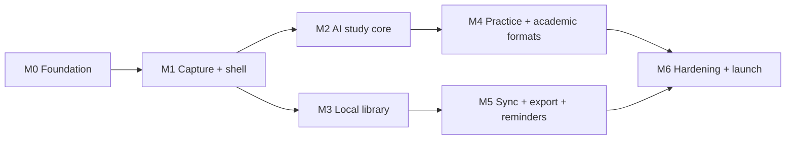

# ClassMate AI — Engineering Work Breakdown

**Version:** 1.0.0  
**Purpose:** Translate the specifications into ordered epics, tasks, dependencies, acceptance evidence, and release gates that a senior delivery team can execute.

## Table of Contents

1. [Execution Model](#1-execution-model)
2. [Milestone 0 — Foundation](#2-milestone-0--foundation)
3. [Milestone 1 — Side Panel and Capture](#3-milestone-1--side-panel-and-capture)
4. [Milestone 2 — AI Study Core](#4-milestone-2--ai-study-core)
5. [Milestone 3 — Library and Offline](#5-milestone-3--library-and-offline)
6. [Milestone 4 — Practice and Academic Formats](#6-milestone-4--practice-and-academic-formats)
7. [Milestone 5 — Account, Sync, Export, and Reminders](#7-milestone-5--account-sync-export-and-reminders)
8. [Milestone 6 — Hardening and Launch](#8-milestone-6--hardening-and-launch)
9. [Cross-Cutting Work](#9-cross-cutting-work)
10. [Examples](#10-examples)
11. [Best Practices](#11-best-practices)
12. [Design Decisions](#12-design-decisions)
13. [Engineering Notes](#13-engineering-notes)
14. [Future Improvements](#14-future-improvements)

## 1. Execution Model

Tasks use stable IDs, owner discipline, dependencies, acceptance evidence, and risk. A task is complete only with empty/loading/error/offline states as relevant, tests, accessibility, localization readiness, privacy/security review, observability decision, and documentation. Milestones are outcome gates, not calendar promises.

## 2. Milestone 0 — Foundation

| ID | Task | Depends | Acceptance evidence |
|---|---|---|---|
| FND-001 | Initialize workspace apps/packages and strict configs | — | Clean install; type/lint/test commands; boundary graph |
| FND-002 | Define domain, artifact, content-block, message, and API schemas | FND-001 | Contract fixtures and compatibility tests |
| FND-003 | Establish CI gates, signing separation, dependency/secret/license scans | FND-001 | Protected main and reproducible unsigned artifact |
| FND-004 | Implement semantic design tokens and accessible primitives | FND-001 | Theme, contrast, zoom, keyboard Storybook evidence |
| FND-005 | Define environment/config validation and safe feature flags | FND-001 | Invalid security config fails closed |
| FND-006 | Create privacy data inventory and threat model | FND-002 | Reviewed flows, retention, trust boundaries, mitigations |
| FND-007 | Build test-kit with clocks, IDs, providers, Chrome harnesses | FND-002 | Shared contract suites execute in both apps |
| FND-008 | Establish ADR, release, incident, and migration templates | FND-003 | Review approval and owners |

**Gate:** Architectural dependency checks pass; no remote code or broad permission; schemas and privacy inventory are approved.

## 3. Milestone 1 — Side Panel and Capture

| ID | Task | Depends | Acceptance evidence |
|---|---|---|---|
| CAP-001 | MV3 manifest, Side Panel entry, service worker, content dispatcher | FND | Fresh load, worker suspension and update tests |
| CAP-002 | App shell, responsive navigation, theme and command palette | FND-004, CAP-001 | 320–800 px, 200% zoom, keyboard journey |
| CAP-003 | Permission education and optional host-access flow | CAP-001, FND-006 | Grant/deny/remove/retry tests and disclosure copy |
| CAP-004 | Selection capture and preview | CAP-003 | Exact normalized selection + sensitive-field exclusion |
| CAP-005 | Generic article/document extractor | CAP-004 | Fixture accuracy, performance, anchor resolution |
| CAP-006 | PDF text extraction adapter | CAP-004 | Text PDF pages, empty/scanned recovery |
| CAP-007 | YouTube transcript availability adapter | CAP-004 | Available/unavailable/localized transcript cases |
| CAP-008 | GitHub/docs/LMS classifiers and safe generic fallback | CAP-005 | Dynamic page fixtures and fallback |
| CAP-009 | Context bar, source inspector, stale-context handling | CAP-004–008 | Visible scope, truncation, refresh and removal |
| CAP-010 | Durable draft/capture operation recovery | CAP-001, FND-002 | Tab switch, close/reopen, crash and suspension tests |

**Gate:** A student can open the panel, understand permissions, capture supported content, inspect scope, and recover from unsupported/restricted sources without data leakage.

## 4. Milestone 2 — AI Study Core

| ID | Task | Depends | Acceptance evidence |
|---|---|---|---|
| AIC-001 | Provider-neutral request/stream/error contracts | FND-002 | Contract suite covers malformed/cancelled streams |
| AIC-002 | Gemini free adapter | AIC-001 | Live canary + recorded protocol fixtures |
| AIC-003 | Groq adapter | AIC-001 | Same contract suite |
| AIC-004 | OpenRouter free-model adapter and catalog filtering | AIC-001 | Paid models excluded by default |
| AIC-005 | Ollama loopback adapter and setup diagnostics | AIC-001 | Explicit endpoint consent and offline test |
| AIC-006 | Capability catalog and free-first bounded router | AIC-002–005 | Policy matrix, no paid fallback, circuit behavior |
| AIC-007 | Chunking, budgets, ranking, coverage metadata | CAP-005, AIC-001 | Long source, selection priority, tokenizer variance |
| AIC-008 | Prompt assembly and summary/explanation templates | AIC-007 | Evaluation gates in prompt spec |
| AIC-009 | Streaming composer/renderer, cancel and checkpoint | AIC-001, CAP-010 | First-token UX, upward-scroll, disconnect recovery |
| AIC-010 | Citation validation and source navigation | CAP-009, AIC-008 | 100% IDs resolve in fixture suite |
| AIC-011 | Structured artifact validation/one repair/fallback | AIC-008 | Invalid JSON and partial artifact cases |
| AIC-012 | Provider settings and device credential vault | FND-006, AIC-006 | No secrets in logs/sync/build; rotation/removal |

**Gate:** Summary, simple/deep explanation, and grounded chat stream from at least two free cloud routes plus Ollama when configured, with visible context and valid citations.

## 5. Milestone 3 — Library and Offline

| ID | Task | Depends | Acceptance evidence |
|---|---|---|---|
| LIB-001 | IndexedDB schema, codecs, upgrade and quarantine | FND-002 | Upgrade/interruption/corruption tests |
| LIB-002 | Sources, artifacts and immutable revision repositories | LIB-001, AIC-011 | Save/edit/original provenance invariants |
| LIB-003 | History, bookmarks, recent and archive | LIB-002 | Filter, undo, retention settings |
| LIB-004 | Folders, collections, tags and cycle prevention | LIB-002 | Keyboard move, multi-membership, delete policies |
| LIB-005 | Local lexical search and rebuildable index | LIB-002 | 10k-item performance and locale cases |
| LIB-006 | Offline shell, saved reading and draft behavior | LIB-002 | Airplane-mode E2E and clear status |
| LIB-007 | Storage estimates, cleanup and quota UX | LIB-001 | Pressure simulation; no silent saved-data loss |
| LIB-008 | Markdown/copy export | LIB-002 | Citations, disclosure, sanitized clipboard/export |

**Gate:** Saved content is fully usable offline, searchable, organizable, exportable, and resilient through upgrades and quota pressure.

## 6. Milestone 4 — Practice and Academic Formats

| ID | Task | Depends | Acceptance evidence |
|---|---|---|---|
| PRC-001 | Flashcard prompt/schema/editor | AIC-011, LIB-002 | Atomicity/grounding eval and edit persistence |
| PRC-002 | Accessible flashcard review and schedule policy | PRC-001 | Keyboard/screen-reader and deterministic scheduler tests |
| PRC-003 | Quiz prompt/schema and question renderers | AIC-011 | Type matrix, distractor quality eval, no answer leak |
| PRC-004 | Attempts, explanations and learning analytics | PRC-002–003 | Append-only attempts and privacy-safe aggregates |
| ACA-001 | 2/5/10/16-mark and university-answer templates | AIC-011 | Rubric/length/command-verb evaluation |
| ACA-002 | Lab record, aim, result, algorithm, flow templates | AIC-011 | No fabricated observation/result tests |
| ACA-003 | Viva and memory-trick templates | AIC-011 | Progressive difficulty and mapping evaluation |
| ACA-004 | Prompt library browse/search/save/customize | AIC-008, LIB-002 | Inherited safety/context, import sanitization |

**Gate:** Practice and academic artifacts are editable, cited, saveable, exportable, pedagogically evaluated, and transparent about rubric limitations.

## 7. Milestone 5 — Account, Sync, Export, and Reminders

| ID | Task | Depends | Acceptance evidence |
|---|---|---|---|
| SRV-001 | Next.js module skeleton, Mongo connection/repositories | FND | Integration DB and boundary tests |
| SRV-002 | Identity, JWT access, refresh rotation, session UI | SRV-001 | Replay/reuse/ownership/security tests |
| SYN-001 | Change log, push/pull/ack and client outbox | SRV-002, LIB-002 | Offline convergence, duplication, lost-response tests |
| SYN-002 | Conflict policies and note merge UI | SYN-001 | Two-device scenario matrix |
| SYN-003 | Tombstones, deletion jobs, data export/account deletion | SYN-001 | Cascade, backup ledger and completion evidence |
| EXP-001 | PDF and Word export jobs/render validation | SRV-001, LIB-008 | Visual diff, citations, expiry and cleanup |
| SHR-001 | Expiring/revocable immutable share snapshots | SRV-002, EXP-001 | Token hashing, enumeration, CSP and revoke tests |
| REM-001 | Revision reminder scheduling and delivery receipts | SRV-001, PRC-002 | DST/timezone/idempotency tests |
| CAT-001 | Server provider proxy/catalog and quotas | SRV-001, AIC-006 | Direct/proxy contract parity and safe logs |

**Gate:** Optional sign-in syncs safely across two devices; conflicts are preserved; deletion/export work; no server dependency breaks local-only mode.

## 8. Milestone 6 — Hardening and Launch

| ID | Task | Acceptance evidence |
|---|---|---|
| REL-001 | Full performance and bundle optimization | Budgets and low-tier device traces |
| REL-002 | WCAG 2.2 AA audit and remediation | Independent findings closed/accepted |
| REL-003 | Penetration/threat-model verification | Critical/high findings closed |
| REL-004 | Prompt/model regression and multilingual quality | All release gates met |
| REL-005 | Load, chaos, provider outage and migration drills | SLO and recovery evidence |
| REL-006 | Privacy notice, store listing, permissions disclosures | Behavior-to-disclosure audit |
| REL-007 | Analytics consent and content-free dashboards | Payload inspection |
| REL-008 | Staged rollout, rollback, incident on-call | Dry run and signed artifacts |
| REL-009 | Fresh install/upgrade/uninstall/data-removal matrix | Supported Chrome versions pass |
| REL-010 | Support and user documentation | Accessible, localized-ready content |

**Launch gate:** Zero open critical/high security or privacy defects; core E2E green; free-first routes verified; restore and rollback rehearsed; store package matches reviewed source.

## 9. Cross-Cutting Work

Every milestone schedules accessibility review, privacy inventory update, threat-model delta, model/prompt evaluation, dependency maintenance, observability, documentation, and user research. Product discovery validates workflows with diverse students, not only feature preference surveys. Metrics are reviewed for unintended engagement incentives.

## 10. Examples

`AIC-009` cannot close when tokens stream in a demo. It closes after cancellation, disconnect, worker suspension, partial checkpoint, reduced motion, screen-reader announcements, provider error, and saved-draft scenarios pass.

`SYN-001` tests a lost server response: the client retries the same mutation ID, the server returns the prior result, and no duplicate revision appears.

## 11. Best Practices

- Deliver vertical student outcomes behind flags rather than isolated technical layers.
- Put uncertainty and high-risk tasks early: Chrome lifecycles, extraction, free quotas, sync.
- Keep task acceptance observable and binary where possible.
- Limit work in progress and integrate continuously.
- Run evaluations whenever prompts, models, chunking, or routing change.

## 12. Design Decisions

Capture precedes AI because grounding depends on reliable source structure. Local library precedes sync so server features enhance rather than define the product. Academic templates follow core structured-output validation. Hardening is continuous, with a final concentrated launch milestone rather than deferred quality.

## 13. Engineering Notes

Task IDs link to requirements, pull requests, test plans, ADRs, and release notes. Estimates are assigned by the executing team after spikes. No task is marked complete based solely on code merge; acceptance evidence is attached. Dependencies represent technical prerequisites, not staffing sequence.

## 14. Future Improvements

Post-launch epics can add adaptive scheduling, semantic retrieval, OCR, paper comparison, collaboration, institution profiles, voice, and on-device models. Each begins with discovery, privacy/threat review, architecture decision, and measurable learning outcome.
