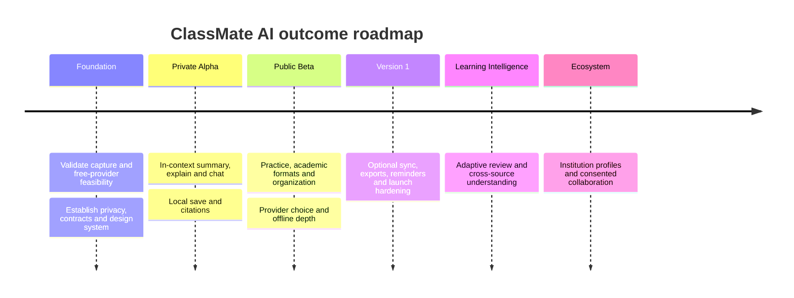

# ClassMate AI — Product and Engineering Roadmap

**Version:** 1.0.0  
**Purpose:** Define outcome-based release phases, sequencing rationale, success gates, risks, rollout strategy, and long-term direction for ClassMate AI.

## Table of Contents

1. [Roadmap Philosophy](#1-roadmap-philosophy)
2. [Release Sequence](#2-release-sequence)
3. [Phase 0 — Evidence and Foundation](#3-phase-0--evidence-and-foundation)
4. [Phase 1 — Private Alpha](#4-phase-1--private-alpha)
5. [Phase 2 — Public Beta](#5-phase-2--public-beta)
6. [Phase 3 — Version 1](#6-phase-3--version-1)
7. [Phase 4 — Learning Intelligence](#7-phase-4--learning-intelligence)
8. [Phase 5 — Ecosystem](#8-phase-5--ecosystem)
9. [Metrics and Decision Gates](#9-metrics-and-decision-gates)
10. [Risks and Contingencies](#10-risks-and-contingencies)
11. [Examples](#11-examples)
12. [Best Practices](#12-best-practices)
13. [Design Decisions](#13-design-decisions)
14. [Engineering Notes](#14-engineering-notes)
15. [Future Improvements](#15-future-improvements)

## 1. Roadmap Philosophy

The roadmap sequences uncertainty and student value, not feature volume. Dates are set by the delivery organization after capacity and discovery; exit gates are invariant. Each phase must preserve free-first operation, local-only use, explicit capture, and accessibility. A later phase may be pulled forward only when its dependencies and risk reviews are satisfied.

## 2. Release Sequence

## 3. Phase 0 — Evidence and Foundation

**Outcome:** Demonstrate that the core promise is technically, legally, and pedagogically viable.

Deliverables include representative extraction prototypes for article/PDF/YouTube/docs/LMS; Side Panel usability studies at narrow widths; free-provider quota/latency/quality benchmarks; prompt-injection threat model; local database and schema spike; structured artifact/citation evaluation set; accessibility design review; and Chrome Web Store permission/disclosure analysis.

Exit criteria: at least 90% usable extraction on the agreed representative fixture corpus; source anchors resolve reliably; at least two free cloud providers and Ollama satisfy baseline tasks; no unresolved architectural blocker; privacy data inventory approved; five or more diverse student studies show the in-panel workflow is understandable.

## 4. Phase 1 — Private Alpha

**Audience:** Invited students and internal testers using synthetic/non-sensitive coursework first.  
**Outcome:** A student can understand content without leaving the page.

Scope: onboarding, just-in-time permissions, selection/page/PDF/transcript capture, context inspection, summary, simple/deep explanation, grounded chat, streaming/cancel, validated citations, Gemini/Groq/OpenRouter free routing, Ollama setup, local history/save, Markdown/copy, dark/light theme, and failure recovery.

Not included: public shares, mandatory accounts, Word/PDF export, adaptive review, or institution profiles.

Exit gates: first useful output p75 within performance targets; ≥ 90% citation coverage on citation-required evaluation; zero invented citation IDs; generation success ≥ 95% in alpha environment excluding cancellation; all critical journeys keyboard-complete; no critical/high security findings; qualitative evidence that context controls are understood.

## 5. Phase 2 — Public Beta

**Outcome:** Move from one-off answers to a repeatable study workflow.

Scope: flashcards, quizzes, viva, memory tricks, 2/5/10/16-mark answers, university/lab formats, folders/collections/tags, local search, offline practice, study analytics, prompt library, local reminders where reliable, broader source fixtures, multilingual beta, and robust storage quota controls.

Rollout begins at 5%, then 20%, 50%, and 100% of eligible beta users. Each step observes a full weekly study cycle and has automatic/operational rollback thresholds.

Exit gates: ≥ 25% of active students complete a practice activity; structured-output validity ≥ 99% after permitted repair; no fabricated lab observations in critical evaluation set; weekly completed study outcomes ≥ 3 for retained beta users; crash-free sessions ≥ 99.5%; accessibility audit has no unresolved critical blockers.

## 6. Phase 3 — Version 1

**Outcome:** A trustworthy, durable, production-supported study copilot.

Scope: optional accounts, multi-device sync and conflict UI, PDF/Word export, expiring share links, server proxy and quota policy, revision reminders, privacy export/deletion, operational dashboards, incident response, internationalization foundation, Chrome Web Store production listing, support content, staged updates, backup/restore, and migration drills.

Version 1 does not make cloud sync or paid AI a prerequisite. Local-only users retain all core study and practice capabilities.

Launch gates: API availability SLO ready; mutation-loss test result zero; backup restore and rollback rehearsed; privacy deletion verified end to end; current plus two previous Chrome versions pass; free route verified from a clean account; store disclosures match packet capture and runtime behavior; support and incident ownership staffed.

## 7. Phase 4 — Learning Intelligence

**Outcome:** Help students retain and connect knowledge, not merely generate more text.

Candidates: adaptive spaced repetition, weakness-based quiz selection, cross-artifact search, source comparison, paper method/result extraction, knowledge maps, on-device embeddings, improved OCR, learning-goal plans, and privacy-preserving aggregate insights.

Entry criteria require trustworthy attempt data, validated learning hypotheses, bias/privacy assessment, and evidence that the feature does not create manipulative engagement. Success is measured by delayed recall and completed review, not time spent.

## 8. Phase 5 — Ecosystem

**Outcome:** Support legitimate institutional and collaborative learning while preserving student control.

Candidates: signed institution/rubric profiles, instructor-authored prompt/study packs, revocable shared collections, accessible peer review, LMS deep links using official APIs, citation-manager export, and community template governance. Assignment submission, surveillance, proctoring bypass, and plagiarism concealment remain outside product scope.

Entry criteria include moderation, consent, role/authorization, data residency, child-safety where applicable, institutional procurement security, and a sustainable free individual tier.

## 9. Metrics and Decision Gates

| Dimension | Metric | Decision use |
|---|---|---|
| Activation | Grounded outcome in first session | Onboarding/capture readiness |
| Learning value | Saved, edited, practised, exported, or revisited artifacts | North-star outcome |
| Grounding | Supported claims and valid anchors | Model/prompt release gate |
| Reliability | Crash-free sessions, completion, sync lag/loss | Rollout/rollback |
| Accessibility | Critical journey and audit status | Release blocker |
| Privacy | Deletion success, telemetry payload audits | Release blocker |
| Free-first | Core completion via free routes | Product promise gate |
| Performance | panel interactive, extraction, first token | Architecture investment |
| Retention | Return for study outcome, not passive opening | Product fit signal |

Metrics are segmented only where ethical and sufficiently anonymous. A/B tests cannot weaken privacy notice, accessibility, academic integrity, or paid-use consent.

## 10. Risks and Contingencies

| Risk | Leading signal | Mitigation/contingency |
|---|---|---|
| Free tier changes | Quota errors/catalog notices | Multi-provider catalog, Ollama, transparent limits |
| Chrome policy/API change | Canary failures/store guidance | Compatibility layer, permission audit, staged build |
| Poor extraction on dynamic sites | Low content/anchor quality | Adapter fixtures, generic fallback, paste/import |
| Hallucinations | Grounding evaluation decline | Source-only defaults, citations, validation, model rollback |
| Prompt injection | Adversarial eval/incident | Privilege separation, no tools, delimiters, sanitization |
| Sync data loss | Conflict/outbox/reconciliation anomalies | Immutable revisions, idempotency, staged rollout, backups |
| Scope overload | Cycle time and UX complexity | Outcome gates, progressive disclosure, explicit exclusions |
| Student misuse | Abuse reports and prompt patterns | Integrity policy, safe redirection, no submission automation |
| Cost spike | Tokens/outcome and fallback increase | Budgets, quotas, route health, local/direct options |
| Accessibility regression | Automated/manual failures | Component contracts and blocking audits |

## 11. Examples

If Gemini’s free tier becomes unavailable during beta, the catalog disables the route, Groq/OpenRouter/Ollama remain available, and the rollout pauses only if free-first completion falls below the gate. The team does not silently route to paid OpenAI.

If practice usage is low but generation is high, the response is not to add gamified streak pressure. Research tests whether artifact conversion, explanation quality, scheduling, or discoverability blocks active recall.

## 12. Best Practices

- Fund discovery and hardening in every phase.
- Use exit criteria to prevent calendar-driven quality compromises.
- Roll out provider, prompt, schema, permission, and sync changes independently where possible.
- Maintain a kill switch and rollback path for risky server-controlled behavior.
- Review metrics with qualitative student evidence.
- Publish meaningful release notes and changed data/permission behavior.

## 13. Design Decisions

Accounts arrive after a valuable local product to preserve privacy and reduce activation friction. Practice follows grounded content because poor source capture creates poor assessments. Collaboration is late because authorization, moderation, and consent substantially expand risk. Learning efficacy, rather than chatbot engagement, guides the mature roadmap.

## 14. Engineering Notes

Each phase maps to task IDs in [11_TASKS.md](11_TASKS.md). Release trains maintain extension/API compatibility and schema migration windows. Canary channels use synthetic or separately consented telemetry. Feature flags include owner, purpose, cohort, start/expiry, dependencies, and rollback behavior. Roadmap review occurs at each milestone and after any material provider or Chrome policy change.

## 15. Future Improvements

The long-term direction may include local multimodal understanding, accessible interactive diagrams, privacy-preserving federated personalization, research-workflow integrations, and student-owned portable learning records. These remain hypotheses until discovery demonstrates educational value and acceptable privacy, safety, accessibility, and free-tier economics.
